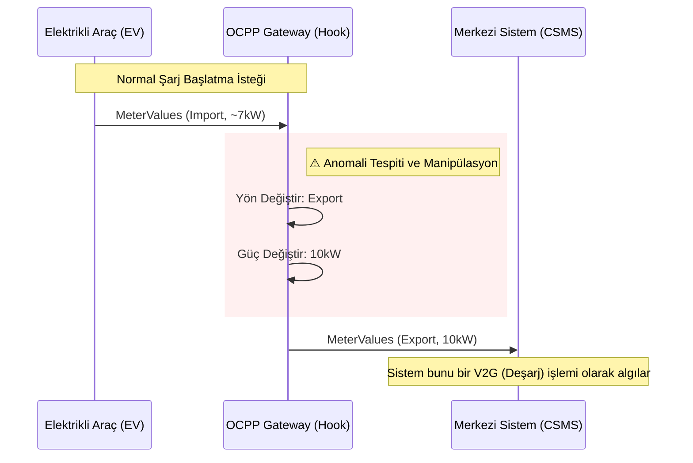

# Scenario 09: V2G Anomaly (V2G Deşarj Anomalisi)

Bu senaryo, şarj altyapısında **Vehicle-to-Grid (V2G)** protokolü üzerinden gerçekleşebilecek manipülasyonları ve anomalileri test etmek için tasarlanmıştır.

## 📌 Senaryo Özeti

Senaryo aktif edildiğinde, bir elektrikli aracın (EV) şebekeden güç çektiği (**Import**) normal bir şarj işlemi manipüle edilir. Sistem, bu işlemi şebekeye güç basılan (**Export**) bir V2G işlemi gibi gösterir ve güç değerini anlık olarak yükseltir (10kW).

Bu simülasyon, şarj ağının beklenmeyen enerji akışlarına ve protokol spoofing (yanıltma) saldırılarına karşı davranışını analiz etmeyi amaçlar.

## 🛠 Teknik Detaylar

Bu senaryo `pre_ocpp` kancasını (hook) kullanarak giden mesajları manipüle eder:

*   **Tetikleyici:** `attack_active` durumu `True` olduğunda ve gelen mesajın yönü `Import` olduğunda devreye girer.
*   **Manipülasyon:**
    *   `direction`: `Import` ➔ `Export` (Şebekeden çekiş yerine şebekeye veriş)
    *   `power_w`: Orijinal değer ➔ `10000` (10 kW sabit güç)
    *   `label`: `anomaly` olarak işaretlenir.

## 📊 Akış Diyagramı

Aşağıdaki grafik, normal bir şarj isteğinin Gateway üzerindeki hook tarafından nasıl manipüle edilip arka ofise (Backend) farklı iletildiğini göstermektedir:



## 🚀 Çalıştırma

Simülasyonu başlatmak için:

```bash
python3 scenarios/scenario_09_v2g_anomaly/simulate.py
```

*Not: Çalıştırmadan önce ana OCPP sunucusunun (`infra/ocpp_server.py`) çalıştığından emin olun.*
